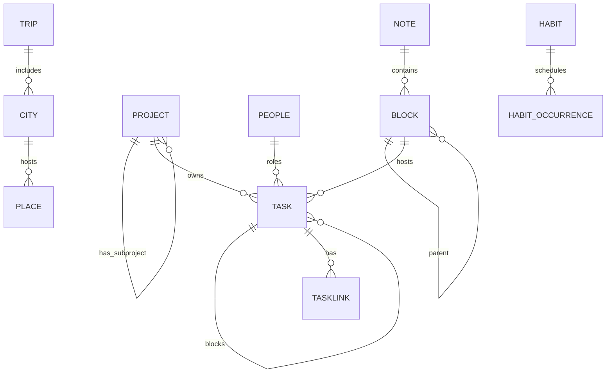

# Project Cortex — System Overview (Expanded, No Pushes)

**Goal:** Deliver a modern, intuitive, offline‑capable personal operating system for projects, tasks, and knowledge. Preserve the _power_ of Org‑mode (outliner, agenda, refile) with the _ease_ of Todoist and the _discipline_ of Taskwarrior—implemented as a web‑first PWA with a thin Node API and PostgreSQL.

---

## Table of Contents

1. [Product Principles](#1-product-principles)
2. [Core Concepts](#2-core-concepts)  
   2.1 [Projects & Subprojects](#21-projects--subprojects) · 2.2 [Standing Projects](#22-standing-projects) · 2.3 [Tasks, Subtasks, Dependencies](#23-tasks-subtasks-dependencies) · 2.4 [PARA + Zettelkasten](#24-para--zettelkasten) · 2.5 [Tags as Lenses](#25-tags-as-lenses) · 2.6 [People & Context Links](#26-people--context-links) · 2.7 [Special Modules (Habits, Travel, Payments, Meetings, Reminders)](#27-special-modules-habits-travel-payments-meetings-reminders)
3. [UX & Interaction Model](#3-ux--interaction-model)
4. [Architecture](#4-architecture)
5. [Data Model (Conceptual)](#5-data-model-conceptual)
6. [Agenda DSL & Filters](#6-agenda-dsl--filters)
7. [Scoring System](#7-scoring-system)
8. [Offline Behavior & Sync](#8-offline-behavior--sync)
9. [Notifications & Reminders](#9-notifications--reminders)
10. [Security & Privacy](#10-security--privacy)
11. [Accessibility & Internationalization](#11-accessibility--internationalization)
12. [Testing & Quality](#12-testing--quality)
13. [Performance Targets & SLOs](#13-performance-targets--slos)
14. [Operations & Backups](#14-operations--backups)
15. [Extensibility & Future Work](#15-extensibility--future-work)
16. [Open Questions & Decisions](#16-open-questions--decisions)
17. [Glossary](#17-glossary)
18. [“Done” Experience](#18-done-experience)

---

## 1) Product Principles

- **Outliner at the core**  
  Everything is a block in a tree (heading, paragraph, todo). Folding, zooming, and virtual indent mirror Org‑mode’s clarity while staying keyboard‑first.

- **Tasks live in Projects**  
  Every task has **one canonical owner** (a Project or Subproject header). Daily/Meeting notes capture and link; they **never** own tasks. This prevents drift and backlink clutter.

- **Refile anywhere—precisely**  
  Refile with fuzzy search to **any header**. Two semantics: **Drop here** (move visually) or **Anchor as subproject** (reassign logical ownership).

- **Agenda is a query**  
  Your views (Today, Next 7, Waiting, Unblockers, Payments, Bookings, Habits) are saved, composable filters—not static lists.

- **Dependencies ≠ Subtasks**  
  Subtasks provide structure (breakdown). Dependencies provide logic (order). “Ready” automatically hides the not‑doable‑now items.

- **Zettelkasten for knowledge**  
  Atomic notes with stable IDs, backlinks, and optional structure notes (MOCs). Tags remain light; links and MOCs carry meaning.

- **Offline‑first**  
  Full offline create/edit with a local store; background sync merges through an events feed. Notifications fire even offline via a small native wrapper.

- **UI‑first ergonomics**  
  Command palette, hotkeys, natural‑language capture, gentle empty‑state onboarding, and tasteful affordances. Power without friction.

- **Security by default**  
  Workspace isolation, least‑privilege access, encrypted transport, optional E2EE for sensitive notes.

---

## 2) Core Concepts

### 2.1 Projects & Subprojects

- **Projects**: named outcomes (Definition of Done, owner, horizon).
- **Subprojects**: promoted headers inside a project. Each subproject has `parent_project_id` and `root_block_id`.
- **Refile precision**:
  - **Drop here only** — Move the block under a header; keep the original project as the logical owner.
  - **Anchor as subproject** — Promote header (if needed) and set the task’s `project_id` to that subproject.

**Example**  
Create task from a procedure step; refile to `#Website Launch/Marketing`. If _Marketing_ later grows, anchor it to become a subproject; agenda now groups as `Website Launch › Marketing`.

---

### 2.2 Standing Projects

Containers for work that “doesn’t belong to an initiative,” preserving the one‑owner rule:

- **Work Ops** — operational/admin tasks (expenses, training, app reviews).
- **Reminders (Tickler)** — date‑driven nudges (e.g., “Rotate tokens each May”).
- **Home Admin** — bills, chores, partner requests.

Use **Context Links** to associate these tasks with relevant notes (e.g., App pages) without moving them from the standing project.

---

### 2.3 Tasks, Subtasks, Dependencies

- **Tasks**: status (`todo/next/wip/waiting/done`), priority, due/scheduled, tags, links, `kind` (payment/meeting/booking/chore/request).
- **Subtasks**: outline children; parent can be **Sequential** (only first open child is considered `Ready`) or \*\*Parallel`.
- **Dependencies (DAG)**: “A blocks B.” Blocked tasks are excluded from `ready:true`; “Unblockers” view surfaces A.

**Rules**

- Completing A unblocks B; B becomes `ready:true`.
- Cycle guard: reject `A blocks B` if B already (directly/indirectly) blocks A.

---

### 2.4 PARA + Zettelkasten

- **PARA** organizes **information**; **Projects** own **actions**.
- **Areas** are dashboards (standards/metrics), not task buckets.
- **Resources** are notes (procedures, references); no tasks live here—only links.
- **Archive** holds completed projects.
- **Zettelkasten**: stable IDs, backlinks, unlinked mentions, structure notes (MOCs).

---

### 2.5 Tags as Lenses

- **Context tags (tasks)**: `@home`, `@errands`, `mode/writing`, `energy/low`, `@5min`.
- **Topic tags (notes)**: `topic/postgres`, `topic/zettelkasten`.
- **Campaign tags (temporary)**: `campaign/may-2026`.

Avoid duplicating modeled fields (e.g., don’t tag `payment` if `kind=payment`). Tags act as filters, not homes.

---

### 2.6 People & Context Links

- **People**: `owner`, `requested_by` for accountability and follow‑ups.
- **Context link**: pointer to a note or header that gives the task “where it belongs mentally” (e.g., App: Payments Service).

---

### 2.7 Special Modules (Habits, Travel, Payments, Meetings, Reminders)

- **Habits**: first‑class; daily slots (AM/PM); streaks; separate from tasks.
- **Travel**: Trip → Cities → Places (gmaps URL, visited/return). Bookings are tasks (`kind=booking`) with open‑link actions.
- **Payments**: tasks with `amount`, `payee`, recurrence, and T‑24h/T‑2h reminders.
- **Meetings**: `kind=meeting` tasks + Prep subtask; Meeting notes capture actions with `#Project/Sub` paths; “Harvest Actions” converts them.
- **Reminders (Tickler)**: date‑driven nudges in their standing project, optionally linked to context notes.

---

## 3) UX & Interaction Model

**Global**

- Command Palette (⌘/Ctrl+K) for create/refile/jump/filter.
- Tabs/Workspaces: pin Today, Payments, Bookings, Habits, and focused project headers.
- Minimal chrome; keyboard help via `?` overlay.

**Outliner**

- Fold/expand per heading; **virtual indent** (ghost padding) to align content cleanly; hide leading markers.
- Zoom into a subtree.
- Keys: `Tab/Shift+Tab` indent/outdent; `Alt+↑/↓` move; `Enter` new sibling; `Shift+Enter` child; `Tab` cycles visibility at a heading.

**Refile Dialog**

- Fuzzy search projects/headers; breadcrumb preview.
- Toggle: **Drop** vs **Anchor** (Alt toggles).
- Recent/favorites; path input `#Project/Sub/Sub2`.

**Agenda**

- Chips (Today, Next 7, Waiting, Ready, Blocked, Kind=Payment/Booking, Tag, Project).
- DSL input for power users; saved views; grouping by `project_path`.
- “Ready” pill; score breakdown chips.

**Capture Bar**

- Natural language: `t <title> #Proj/Sub due Fri 4pm @tags after "Other Task"`.
- Instant refile; meeting capture supports `- [ ]` action lines.

**Meeting Mode**

- Starts within ±15 m of scheduled time.
- Left: notes; right: actions capture; top: brief/deck links; bottom: “Harvest Actions.”

**Travel Mode**

- Shows today’s bookings, next city, recently added places; one‑tap visited/return toggle.

**Mobile**

- PWA offline; large tap targets; quick capture widget; share‑to‑Inbox; local notifications (wrapper).

**Accessibility**

- Radix primitives, focus rings, ARIA labels, prefers‑reduced‑motion, color‑contrast AA+.
- Keyboard‑only flows for all critical actions.

---

## 4) Architecture

**Client**

- Next.js (App Router, TS).
- Local store: Dexie (IndexedDB) mirrors key entities + outbox.
- TanStack Query with persistence.
- Workbox SW caches shell and handles background sync.

**API**

- Node (tRPC/Express). Thin RPC endpoints for atomic ops (refile, dependency add/remove, complete, capture parse).
- REST fallback or GraphQL later if desired.

**Worker**

- Job processor: reminders, recurrence, agenda snapshotting, emails/slack (optional).
- Reads `jobs` table; executes and records outcomes.

**Database**

- PostgreSQL: relational + JSONB; FTS via `tsvector`; adjacency list for blocks; DAG for dependencies; `events` feed for sync.
- Later: RLS for multi‑tenant; pgvector for semantic relatedness (optional).

**Infra**

- Dockerized Postgres (sandbox/dev/prod DBs), Adminer/pgAdmin locally, Makefile targets for backup/restore.
- Secrets via env; migrations via Drizzle/SQL once schema is introduced.

---

## 5) Data Model (Conceptual)

> This is conceptual; actual DDL comes later. Names reflect server types.

### Entities

- **Note**: `id`, `zettel_uid`, `title`, `tags[]`, `metadata{}`
- **Block**: `id`, `note_id`, `parent_block_id?`, `level`, `type`, `attrs{}`, `content`, `sort_order`
- **Project**: `id`, `title`, `role(project|subproject)`, `parent_project_id?`, `root_block_id?`
- **Task**: `id`, `block_id`, `project_id`, `parent_task_id?`, `status`, `priority`, `due_at?`, `scheduled_at?`, `repeat_rule?`, `kind?`, `amount?`, `payee?`, `tags[]`, `props{}`, `owner?`, `requested_by?`, `context_note_id?`/`context_block_id?`, `score_cached?`
- **Dependency**: `src_task_id`, `dst_task_id`, `kind`
- **People**: `id`, `name`, `email?`, `phone?`, `meta{}`
- **TaskLink**: `task_id`, `url`, `label?`
- **Habit**: `id`, `title`, `schedule{freq,slots,until}`, `start_date`
- **HabitOccurrence**: `habit_id`, `date`, `slot`, `completed`
- **Trip**: `id`, `title`, `start_date`, `end_date`
- **City**: `id`, `trip_id`, `name`
- **Place**: `id`, `city_id`, `name`, `category`, `gmaps_url`, `visited`, `want_to_return`, `rating?`
- **Event**: `id`, `entity`, `entity_id`, `action`, `changed{}`, `created_at`

### Relations Diagram (Mermaid)



### Example Task (JSON)

```json
{
  "id": "TASK-123",
  "title": "Remind team: rotate tokens",
  "project_id": "proj-reminders",
  "block_id": "blk-789",
  "status": "todo",
  "due_at": "2026-05-01T09:00:00Z",
  "repeat_rule": "every year",
  "tags": ["@office"],
  "owner": "me",
  "requested_by": "Security",
  "context_note_id": "note-app-payments",
  "links": [{ "url": "https://wiki/runbook/token-rotation", "label": "Runbook" }]
}
```

---

## 6) Agenda DSL & Filters

**Design goals**: human‑readable, small surface, compiled to SQL (or Dexie queries in client‑only mode).

### Grammar (EBNF‑style)

```
query        := expr ( "ORDER BY" order )?
expr         := or_expr
or_expr      := and_expr ( "OR" and_expr )*
and_expr     := term ( "AND" term )*
term         := factor | "-" factor | "(" expr ")"
factor       := key ":" value | key comparator value | flag
key          := "project" | "status" | "tag" | "kind" | "due" | "scheduled" | "ready" | "blocked" | "blocking" | "parent" | "area" | "context"
comparator   := "=" | "!=" | "<=" | ">=" | "<" | ">"
value        := string | date_expr | number
flag         := "ready:true" | "ready:false" | "blocked:true" | "blocked:false"
order        := field ( "ASC" | "DESC" ) ( "," field ( "ASC" | "DESC" ) )*
field        := "score" | "due_at" | "scheduled_at" | "priority"
date_expr    := "today" | "tomorrow" | "thisweek" | "+7d" | "next14d" | ISO_DATE
```

### Examples

- **Today**  
  `(scheduled:today OR due:today) AND -status:waiting AND ready:true ORDER BY scheduled_at, score DESC`

- **Unblockers**  
  `blocking:true AND status IN (todo,next) ORDER BY score DESC`

- **Payments (30d)**  
  `kind:payment AND due <= +30d ORDER BY due_at ASC`

- **By Context (App: Payments)**  
  `context:"App: Payments Service" AND status IN (todo,next)`

### Mapping to SQL (sketch)

- `ready:true` → `status IN ('todo','next') AND (scheduled_at IS NULL OR scheduled_at <= now()) AND NOT EXISTS (SELECT 1 FROM task_dependencies d JOIN tasks t ON t.id=d.src_task_id WHERE d.dst_task_id=tasks.id AND t.status NOT IN ('done','cancelled'))`
- Date ranges → normalize to `timestamp with time zone` using server tz (or per‑user tz).
- `context:"..."` → join on notes by title or use `context_note_id` directly.

---

## 7) Scoring System

Weighted sum of normalized factors (0..1). Tunable per user.

**Factors (suggested)**

- `due` — urgency grows as due approaches/overdue.
- `scheduled` — bump if schedule time is now/past.
- `priority` — A=1, B=0.65, C=0.3.
- `age` — gentle nudge for older tasks.
- `blocked` — negative if any open blockers.
- `critical` — positive for long downstream chains (approx. critical path).
- `project_focus` — positive if in the currently pinned project.
- `tags` — small boosts for context/time‑fit (`@evening`, `@5min`).
- `effort` — slight boost for short tasks to encourage clearing small items.

**Example**

```
score = 1.0*due + 0.6*scheduled + 0.8*priority + 0.2*age - 0.9*blocked + 0.3*critical + 0.3*project_focus + 0.2*tags + 0.1*effort
```

**UI**: display pill chips with factor contributions; clicking a pill explains the factor.

---

## 8) Offline Behavior & Sync

- **Local first**: Create/edit update Dexie immediately; UI updates optimistically.
- **Outbox**: queued mutations (create, update, refile, dependency changes).
- **Sync loop**: post outbox → server writes & appends `events` → client polls `events since cursor` → reconcile into Dexie.
- **Conflicts**: last‑writer‑wins per field + user hint (“moved under X while you marked done”).
- **Storage**: request persistent storage (`navigator.storage.persist()`); graceful degradation when not granted.
- **Error handling**: show retriable toasts; keep local data until server confirms.

---

## 9) Notifications & Reminders

- **Web Push** for browsers; **local notifications** via Capacitor on mobile for offline reliability.
- **Scheduling**: on task save, enqueue T‑24h and T‑2h jobs for `due_at` or `scheduled_at`; for bookings, schedule at `boarding`/`check‑in`.
- **Timezone & DST**: store timestamps in UTC; display in user tz; schedule jobs in UTC; shift recurrences respecting calendar rules (business‑day logic optional).
- **Nudges**: for `waiting` tasks, create a follow‑up job (e.g., `+2d`).

---

## 10) Security & Privacy

- **Transport**: TLS everywhere.
- **At rest**: managed Postgres encryption; hashed secrets; minimal PII.
- **Workspaces**: single user initially; later add RLS (rows scoped to workspace/user).
- **E2EE option**: client‑side encrypt note contents; metadata remains searchable; content FTS disabled for encrypted notes.
- **Access logs**: minimal, anonymous telemetry opt‑in.

---

## 11) Accessibility & Internationalization

- **A11y**: semantic markup, landmarks, ARIA attributes, keyboard parity for all actions, focus management in dialogs, color‑contrast AA+, reduced‑motion support.
- **i18n**: date/time formats, 24h/12h time, locale‑aware parsing for capture (where feasible), RTL layout readiness, string extraction for translation.

---

## 12) Testing & Quality

- **Unit tests**: scoring, DSL compiler, dependency cycle checks, capture parser.
- **Integration**: API RPCs (refile, deps), Dexie hooks, sync loop with a mock server.
- **E2E**: agenda flows, outliner operations, refile to header, meeting “Harvest Actions,” payments/bookings agenda visibility, habits checkoff.
- **Manual testing**: mobile PWA install, offline flows, notifications.
- **Quality gates**: typecheck, lint, unit+integration tests must pass before merge.

---

## 13) Performance Targets & SLOs

- **Cold load**: ≤ 2.5s to interactive on a mid‑range mobile.
- **Navigation**: ≤ 150ms view switch (shell cached).
- **Agenda query**: ≤ 120ms for typical filters; ≤ 500ms worst‑case with 25k tasks.
- **Outliner**: 60 fps while folding/moving up to 2k visible nodes; virtualize large trees.
- **Sync**: events polling interval ~2s; apply batch in ≤ 100ms.
- **Notifications**: job execution jitter ±60s; local notifications on time.

---

## 14) Operations & Backups

- **Backups**: nightly dumps retained 7/30 days; on‑demand `make db:backup`.
- **Restore**: `make db:restore` to sandbox; verify with smoke tests.
- **Migrations**: semantic versioned, forward‑only; generate down scripts for safety.
- **Monitoring**: logs (structured), metrics (queue depth, job latency), error reporting.
- **Admin**: Adminer/pgAdmin locally; read‑only analytics later.

---

## 15) Extensibility & Future Work

- **Integrations**: ICS import/export, email‑to‑Inbox, Slack/Discord notifications, Google Drive/Notion links.
- **Semantic search**: pgvector for “Related notes” and discovery.
- **Automations**: stuck project lints, suggest “promote header to subproject,” suggest due dates.
- **Geofenced reminders** (native wrapper).
- **Collaboration**: optional CRDTs for shared notes/projects; role‑based access.

---

## 16) Open Questions & Decisions

- **Zettel ID format**: timestamp vs short hash (timestamp is friendlier).
- **Agenda DSL syntax**: final operators and precedence; user‑visible docs.
- **Default scoring weights**: tuned per user or global? Provide presets.
- **Business‑day rules**: for payments and recurrences—how strict?
- **Encrypted notes**: key management and search trade‑offs.
- **Context link semantics**: prefer note vs header preference?

---

## 17) Glossary

- **Anchor as subproject** — Promote a header to a subproject and reassign task ownership.
- **Drop here only** — Move a task under a header visually but keep project ownership.
- **Ready** — `status ∈ {todo,next}` AND not blocked AND `scheduled_at` not in the future.
- **Tickler** — A reminder task in the Reminders project.
- **MOC** — Map of Content (structure note).
- **Standing Project** — Long‑lived container (Work Ops, Home Admin, Reminders).

---

## 18) “Done” Experience

- **Capture → Refile** feels instant; you always know where things live.
- **Today** surfaces exactly what’s actionable, with clear due/scheduled times and scores.
- **Meetings**: prep nudges arrive on time; actions land in the right projects; summaries are easy.
- **Travel**: bookings appear when needed; places are easy to manage per city.
- **Home Admin**: bills never slip; chores occur at sensible times; partner requests get due dates and follow‑ups.
- **Offline**: everything works; sync is seamless; notifications are trustworthy.
- **Interface**: modern, quiet, keyboard‑friendly, with power available when you want it.
